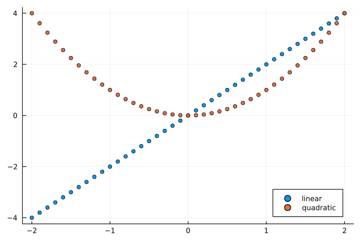

# HoeffdingD.jl
HoeffdingD.jl implements in pure Julia the Hoeffding measure of dependence as described in the original paper: [A Non-Parametric Test of Independence](https://projecteuclid.org/journals/annals-of-mathematical-statistics/volume-19/issue-4/A-Non-Parametric-Test-of-Independence/10.1214/aoms/1177730150.full) in particular chapter 5. The package also implements the D-test of independence described in chapter 9 of the same paper.

The advantage of this statistic is to detect nonlinear relationships that Pearson's correlation or Spearman's rank correlation are unable to detect.

## Installation
Enter the Pkg REPL by pressing ```]``` from the Julia REPL. Then install the package with: ```pkg> add https://github.com/ericqu/HoeffdingD```

## Usage

Here we demonstrate the classic example of detecting linear and quadratic relationships with Hoeffding measure contrasted with Perason Correlation and Spearman's rank correlation.

### Data generation
```julia 
x = -2:0.1:2
linear_f(x) = 2x ; quad_f(x) = x^2
y_linear = linear_f.(x)
y_quad = quad_f.(x)
```

which can be displayed as:
```julia
using Plots
scatter(x, y_linear, label="linear")
scatter!(x, y_quad, label="quadratic", legend=:bottomright)
savefig("docs/linquad.png")
```


### Classic test

```julia
using StatsBase

#Pearson Correlation
@show(StatsBase.cor(x, y_linear))
@show(StatsBase.cor(x, y_quad))
#Spearman's rank correlation
@show(StatsBase.corspearman(x, y_linear))
@show(StatsBase.corspearman(x, y_quad))
```
which gives
```
StatsBase.cor(x, y_linear) = 1.0
StatsBase.cor(x, y_quad) = 0.0
StatsBase.corspearman(x, y_linear) = 1.0
StatsBase.corspearman(x, y_quad) = 0.0
```
Both concurring that there is no correlation with the quadratic relationship.

### Hoeffding D measure and D-test
This can be contrasted with the Hoeffding measure.
```julia
@show(HoeffdingD.hoeffdingd(x, y_linear))
@show(HoeffdingD.hoeffdingd(x, y_quad))
```
gives:
```
HoeffdingD.hoeffdingd(x, y_linear) = 1.0
HoeffdingD.hoeffdingd(x, y_quad) = 0.2183712793468891
```
Which like Pearson Correlation and Spearman rank correlation indicates a perfect relationship for the linear relationship.
For the quadratic relationship the D (dependence) value appears to be non-zero, but can the independence be ruled out?
For that purpose we need to provide an α (between 0 and 1).
```julia
@show(HoeffdingD.hoeffdingd(x, y_linear, 0.05))
@show(HoeffdingD.hoeffdingd(x, y_quad, 0.05))
```
Which gives:
```
HoeffdingD.hoeffdingd(x, y_linear, 0.05) = (1.0, true)
HoeffdingD.hoeffdingd(x, y_quad, 0.05) = (0.2183712793468891, true)
```
The function now returns the D value with the result of the D-test of independence for the given α. Therefore indicating that in both case we can reject the H₀ hypothesis of independence.


## Questions
Please post your questions or issues in the Issues tabs.